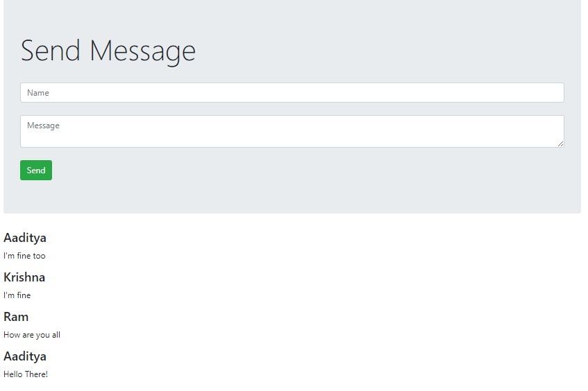

# Simple Chat App

A list of projects created while learning Node. The projects ideas are not my original so are compiled into a single repository. The list will grow as I learn more stuff.

# ScreenShots

# Installation

1. Open the root folder in the terminal and enter the following command:

    `npm install`

2. Start the project server from the terminal:

    `npm start`

3. Enter the following url in your browser:

    ` http://localhost:3000`
    

# Important!

The system implements temporary storage initially but you can implement the MongoDB version by using the MongoDB code inside the server.js file.

Instruction are given in the MongoDB Config section comments.